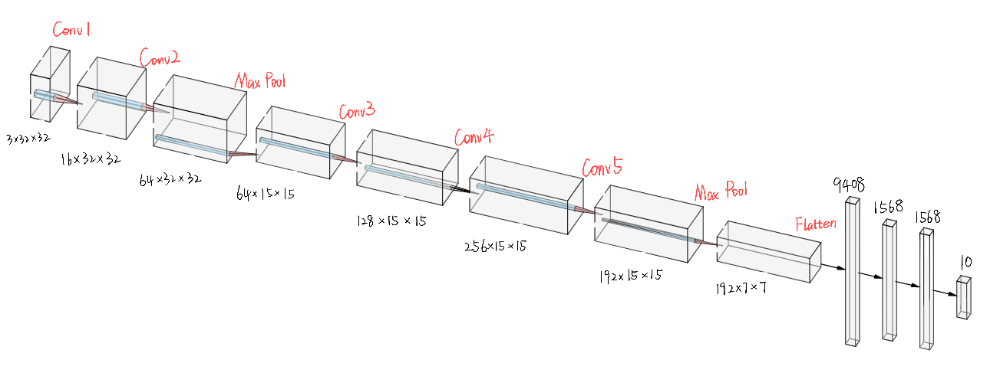
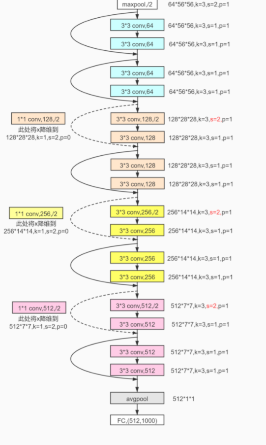
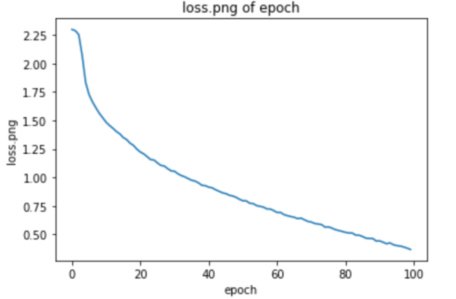
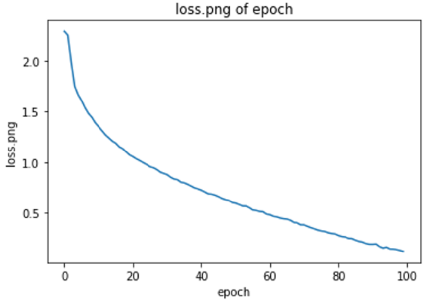
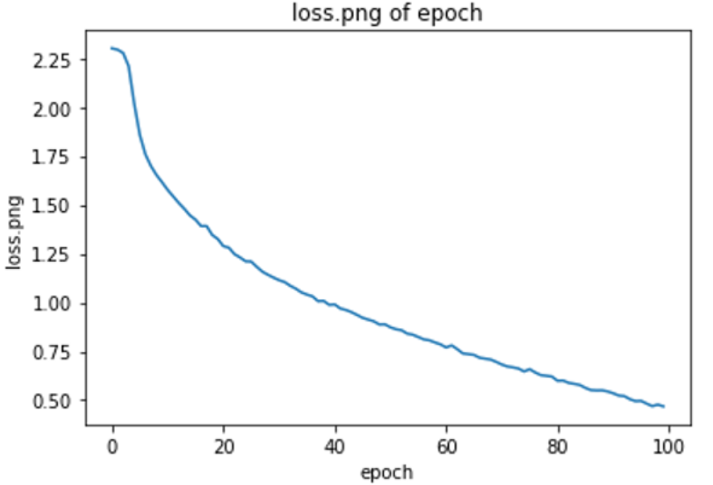
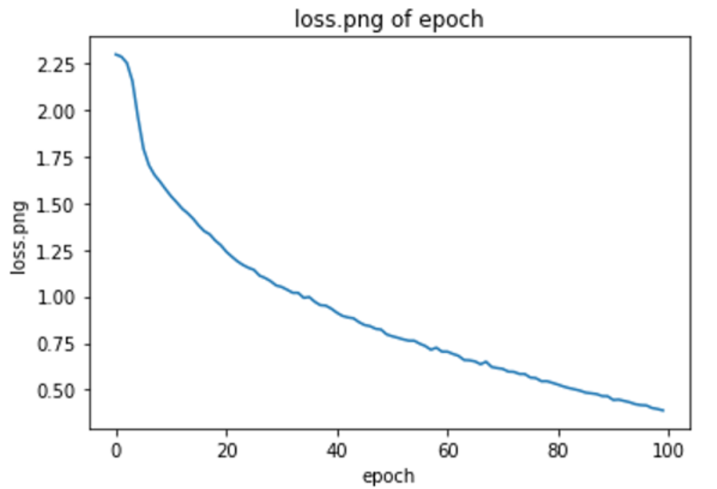
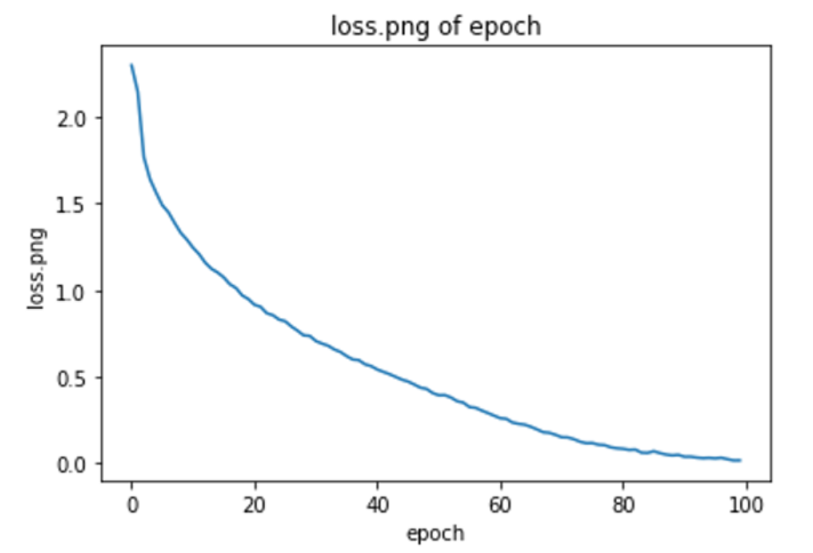
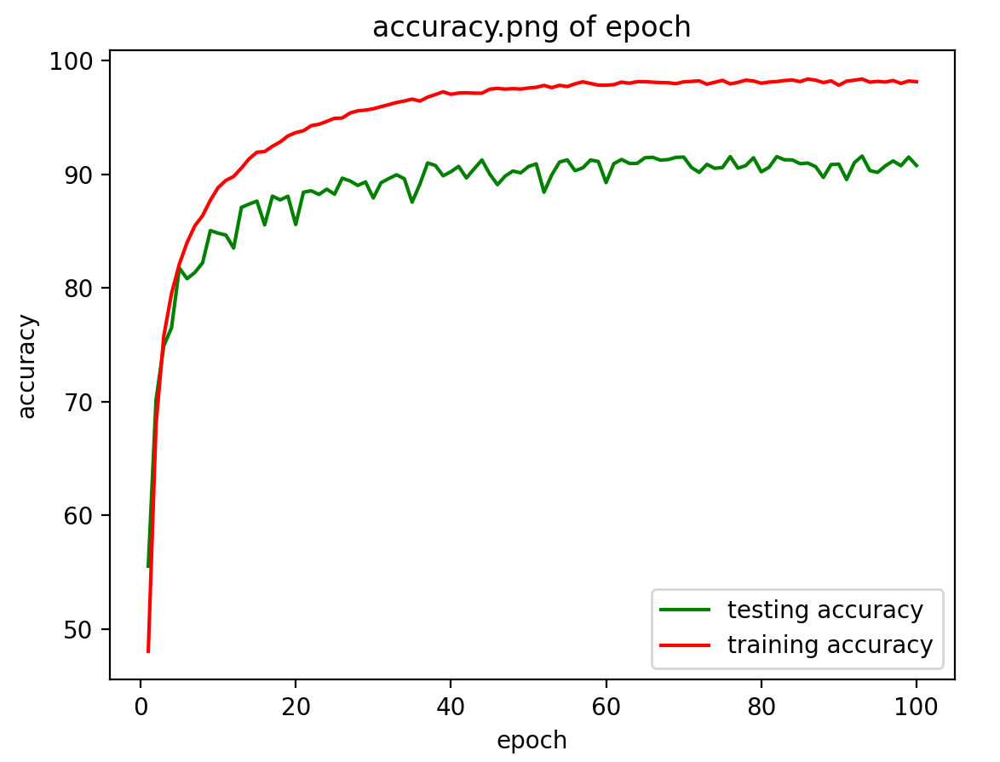

## I. 数据处理

为了缓解实验过程中可能出现的过拟合，我们采用了Data Augmentation（数据增量）的方案。在本次实验中，我们采用了transforms操作进行数据增强。

具体地，我们通过概率水平翻转和竖直翻转给定的PIL图像来人工地增大数据集

```
transforms.RandomHorizontalFlip(0.5),
transforms.RandomVerticalFlip(0.5),
```

此外，我们还使用transforms.ToTensor()将数据分布调整到（0，1）之间，并使用Normalize进行计算，将数据归一化到（-1,1）之间，从而让数据更加贴合正态分布。


## II. 系统设计

### 1. 模型设计

关于本次大作业的模型设计，从图像分类的任务出发，我们决定选择CNN图像分类算法以及其相关的模型。

首先，我们根据PyTorch的tutorial实现了基础的CNN图像分类算法，设计出了一个具有两个卷积层的卷积神经网络，并对其进行实验。经过一些参数调试之后，我们发现，这个模型不能满足我们的作业要求，虽然这个模型的较为简单，训练用时也非常短，但是这个简单的CNN模型在Cifar-10数据集上训练后进行测试的准确率仅有55%左右。

在此基础上，我们调研了当前学术界较为知名、用途广泛的CNN模型，其中有AlexNet、VGG、ResNet，GoogLeNet等。经过调研和阅读，我们决定在AlexNet的基础上，根据Cifar-10数据集的特征，实现自己的CNN模型。实现自己的模型之后，经过一系列的模型优化和参数调试，最终能够达到大约79%的准确率。这个结果相比于最初的模型已经有了很大的提升，在Cifar-10数据测试集上图像分类的效果很好。

但是，这还是没有达到我们的预期目标，为了使我们的实验结果更进一步，达到更为精确的图像分类效果，我们又转而采用当前学术界和工业界广泛使用的ResNet残差网络模型，经过代码实现，最终在Cifar-10数据测试集上达到92.35%的结果。这个结果超出我们的预期，完全实现了我们对于此次项目的目标。

下面，我们会一一介绍上述提到的各个模型。

#### A. Shallow CNN

Shallow CNN model是我们最开始尝试的模型，它的网络设计和PyTorch官方的CNN tutorial给出的模型是一致的，输入$32*32*3$的RGB三通道图片，经过两个卷积层、两个池化层、两个非线性激活层，经过Flatten连接到三个全连接层，将最终结果映射到$10*1$的向量进行label的判断，损失函数采用常用的交叉熵，利用随机梯度下降进行参数更新。

这个卷积神经网络只有两个卷积层，卷积核大小分别为$5*5$和$5*5$。这个网络的效果非常差，在$EPOCH=100 \ LR=0.001$的条件下训练出的模型在Cifar-10的准确率只有55%左右。

分析其效果不佳的原因，我认为这个网络只有两个卷积层，且每个卷积层卷积核数量非常少，无法提取到足够的图像信息。而且在Cifar-10数据集本身图像较小的情况下经过两个MaxPool池化层处理，损失了较多图像信息。另外，这个模型没有正则化，容易导致梯度爆炸和梯度消失，导致反向传播和参数更新的效果不佳。

以上都是导致这个模型效果不佳的原因。


#### B. ElexNet : Inspired by AlexNet

在经历了Shallow CNN的失败后，我们从其中总结经验教训，考虑从卷积层数量、池化层位置、正则化等方面入手，设计更加优化的模型，以期得到更好的实验结果。

在查阅了论文和资料后，我们了解了当前学术界和工业界一些主流的CNN算法的实现，例如AlexNet、VGG、ResNet，GoogLeNet等。这些模型都在卷积层、卷积核等很多方面做了优化。在综合评估后，我们决定首先在AlexNet的基础上搭建一个CNN网络。下图是AlexNet的模型结构。


在AlexNet的启发下，我们搭建了自己的模型，并将其命名为ElexNet。考虑到Cifar-10数据集图片本身尺寸很小的特点，我们并没有完全按照AlexNet论文的描述实现卷积神经网络，而是根据测试效果，调整了卷积核的大小，使其适应数据集的特点。另外，我们还删除了第一个卷积层Conv1之后的池化层Overlapping Max Pool，原因是Cifar-10数据集尺寸过小，经过池化层处理后会损失很多信息。经过测试，我们还修改了一些对模型结果影响不大的结构，以加快拟合速度。

最终，ElexNet在Cifar-10测试集上的测试准确率为79%，这个效果相比与Shallow CNN有了很大的提升。



#### C. ResNet-18

经历了ElexNet的成功后，我们仍然觉得79%的测试准确率仍然有些低。

这时，我们将目光投向了被称为CNN图像史上里程碑的ResCNN，期望能达到更高的准确率。根据ResNet论文中给出的结构列表，我们搭建了18层的RNN网络。下图是ResNet-18模型的详细结构。



ResNet-18由17层卷积层和1个全连接层组成。网络中存在两种不同的基本块：一种是在通道数不变的情况下，进行的残差结构运算，如上图中实线标注的跳跃连接部分；另一种则是在进行残差结构运算时，发生了通道数改变，如上图中虚线部分所示。我们分别将他们作为不同的基本块。在卷积操作都完成后，通过平均池化avgpool层最终到达全连接层。此外我们还对图像预处理的参数进行了一些优化，使得数据分布更加正则。

在最后的测试中，ResNet-18在Cifar-10测试集上的准确率最高可以达到92.35%，相比之前的两种模型而言可以说是有了质的飞跃。


### 2. 训练方法

我们首先使用torchvision加载了CIFAR10训练集和测试集，并对数据集做了归一化。对于训练集，我们还使用transforms进行了Data Augmentation来缓解可能出现的过拟合。

之后我们创建了Convolutional Neural Network，并使用交叉熵来评估loss，定义了loss function。

紧接着，我们在GPU上使用自己定义的network进行迭代计算。从训练集中不断取出样本输入到网络中，计算出实际的输出和理想输出的差，即loss，打印出loss并绘制loss图像用于辅助分析，并按照极小化误差的方法反向传播调整权矩阵。经过100次epoch后结束训练。

训练完成后，我们将测试集输入到所得的模型中，将输出结果与真实值比较，并记录下模型的预测准确率。

接下来，我们不断更新network的模型和参数一次次进行训练和迭代。最终，我们筛选出预测准确率最高的模型和参数设置。


## III. 实验结果

### 1. Shallow CNN

#### A. 预测准确率

Shallow CNN的准确率在最好情况下只有55%

#### B. 训练过程

我们对Shallow CNN的模型进行搭建之后，设置Batch Size=256 EPOCH=100进行训练，每次训练用时大概为20s。

#### C. 调参实验及结果分析


调整了多组Batch Size、Kernel Size等参数，模型准确率均没有太大变化。

由于这个模型只有两层卷积层，卷积核尺寸也非常小，对于图像信息的提取能力非常弱，这些模型固有的缺陷制约了准确率的提高，无论如何调整参数都不可能达到较好的效果，因此我们在这个模型上并没有耗费太多时间。

### 2. ElexNet

#### A. 预测准确率

ElexNet在最佳情况下的预测准确率为79%

#### B. 训练过程

下图给出了**最终版本**ElexNet在最佳情况时的loss变化，从图中可以看到，在训练的初始阶段，loss下降很快，随着epoch增加，loss下降的速度逐渐降低，并最终趋于平稳。


#### C. 调参实验及结果分析

针对ElexNet模型，我们对其网络结构进行了一些列调整，以达到更好的训练效果。

##### a. 

下图为最初版本ElexNet的模型参数，在这组模型参数下调整Batch Size，以epoch=100的条件运行，得到的结果在Cifar-10测试集上的准确率为70%


| plane | car   | bird  | cat   | deer  | dog   | frog  | horse | ship  | truck | total |
| ----- | ----- | ----- | ----- | ----- | ----- | ----- | ----- | ----- | ----- | ----- |
| 72.1% | 84.1% | 71.4% | 53.8% | 64.8% | 62.9% | 76.4% | 74.5% | 72.9% | 75.9% | 70%   |

总体准确率为70%，在cat类别上的预测准确率非常低。

考虑到这个模型已经有足够的深度，收到计算资源的限制，继续增加深度会带来很多的训练时间增长，我们考虑从卷积核数量入手，在卷积层增加卷积核的数量，以期达到更好的训练效果。

##### b.

针对上述问题，我们调整了模型参数，作出一些改进，在对每个卷积层都增加了卷积核的数量，使用更多的参数进行非线性函数的拟合。


| plane | car   | bird  | cat   | deer  | dog   | frog  | horse | ship  | truck | total |
| ----- | ----- | ----- | ----- | ----- | ----- | ----- | ----- | ----- | ----- | ----- |
| 78.6% | 81.4% | 51.9% | 60.3% | 71.8% | 64.2% | 77.6% | 76.3% | 82.5% | 81.9% | 72%   |

总体预测准确率达到72%，相比于原始的模型上升了2%。在细分种类中，对于ship、truck、plane的分类能力显著提升，但是对于bird的分类能力降低较多。虽然准确率有所上升，但是仍然没有达到我们的预期。还需要继续改进模型。

##### c.

考虑到Cifar-10数据集的自身尺寸小的特点，我们进行了针对性的调整，删除了第一个卷积层后的池化层，原因是Cifar-10本身为$32*32*3$，在小尺寸的数据集上进行池化会损失较多图片信息。删除第一层池化层之后，模型对于图像细节信息的提取更强，可以提高分类能力。


| plane | car   | bird  | cat   | deer  | dog   | frog  | horse | ship  | truck | total |
| ----- | ----- | ----- | ----- | ----- | ----- | ----- | ----- | ----- | ----- | ----- |
| 80.8% | 86.5% | 68.6% | 61.1% | 75.4% | 68.2% | 84.6% | 80.7% | 85.0% | 84.2% | 77%   |

可以看到，删除了第一层池化层之后，模型分类准确率提升显著，从72%上升至77%。在各个细分种类的分类能力也均有所提升。这说明我们的优化思路是正确的，模型对于细节信息的提取能力大大增强。

##### d.

为了进一步优化分类效果，我们又对这个模型进行了探究。经过仔细探究发现，第一层的卷积层stride=1 kernel_size=7 padding=0，这样的卷积核参数导致我们损失了图像边缘的部分信息，为此我们喧杂再次修改参数，为第一层卷积层增加大小为3的padding，以充分利用边缘的信息。在这样的参数条件下，模型的预测准确率达到了79%，相较于不加padding提升了2%。


##### e.

我们还调整了学习率分别进行了多次测试

| 学习率 | 0.0008 | 0.001 | 0.0012 | 0.0014 | 0.0016 | 0.0018 |
| ------ | ------ | ----- | ------ | ------ | ------ | ------ |
| 准确率 | 76%    | 79%   | 78%    | 76%    | 76%    | 78%    |

最终发现当学习率为0.001时，准确率以微弱的优势胜出。而在这几组实验中，loss图像相差微乎其微，肉眼几乎无法观察出其差别，因而我们认为其图像近似相同。最终，我们觉得选用准确率最高的那组参数，即学习率为0.001。

下面，依次给出不同学习率的loss图像：

学习率=0.0008



学习率=0.001


学习率=0.0012



学习率=0.0014



学习率=0.0016



学习率=0.0018



#### D. 参数量

以最终版本的ElexNet为准，这个模型的参数量还是十分可观的，也正是这么多的参数量带来了模型精度的提升。

```
----------------------------------------------------------------
        Layer (type)               Output Shape         Param #
================================================================
            Conv2d-1          [500, 16, 32, 32]           2,368
              ReLU-2          [500, 16, 32, 32]               0
       BatchNorm2d-3          [500, 16, 32, 32]              32
            Conv2d-4          [500, 64, 32, 32]          25,664
              ReLU-5          [500, 64, 32, 32]               0
       BatchNorm2d-6          [500, 64, 32, 32]             128
         MaxPool2d-7          [500, 64, 15, 15]               0
            Conv2d-8         [500, 128, 15, 15]          73,856
              ReLU-9         [500, 128, 15, 15]               0
           Conv2d-10         [500, 256, 15, 15]         295,168
             ReLU-11         [500, 256, 15, 15]               0
           Conv2d-12         [500, 192, 15, 15]         442,560
             ReLU-13         [500, 192, 15, 15]               0
        MaxPool2d-14           [500, 192, 7, 7]               0
           Linear-15                [500, 1568]      14,753,312
           Linear-16                [500, 1568]       2,460,192
           Linear-17                  [500, 10]          15,690
================================================================
```


### 3. ResNet-18

#### A. 预测准确率

ResNet-18在最佳情况下的预测准确率高达92.35%

#### B. 训练过程

下图给出了**最终版本**ResNet-18在最佳情况时的loss变化，从图中可以看到，在训练之初，loss下降很快，随着epoch不断增大，loss下降速度逐渐放缓，并最终趋于平稳状态。


下图给出了**最终版本**ResNet-18在最佳情况时测试准确率的变化，从图中可以看到，在训练开始之初，随着epoch的增加，训练集的测试准确率和测试集的测试准确率都在迅速增加，而后两组数据集的准确率增长速度几乎同时放缓，并在不断波动的同时继续增大，最后趋于平稳。其中，测试集的测试准确率增长速度放缓更为明显，波动也更为剧烈，且随着epoch的继续增加，波动的幅度也越来越小，并且最终稳定在了90%以上。



#### C. 调参实验及结果分析

针对ResNet18，我们调整了模型的学习率进行测试，但是结果没有显著差异，因此不在此赘述

#### D. 参数量


